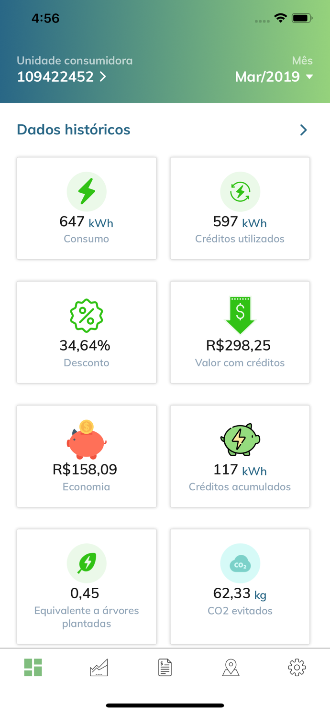
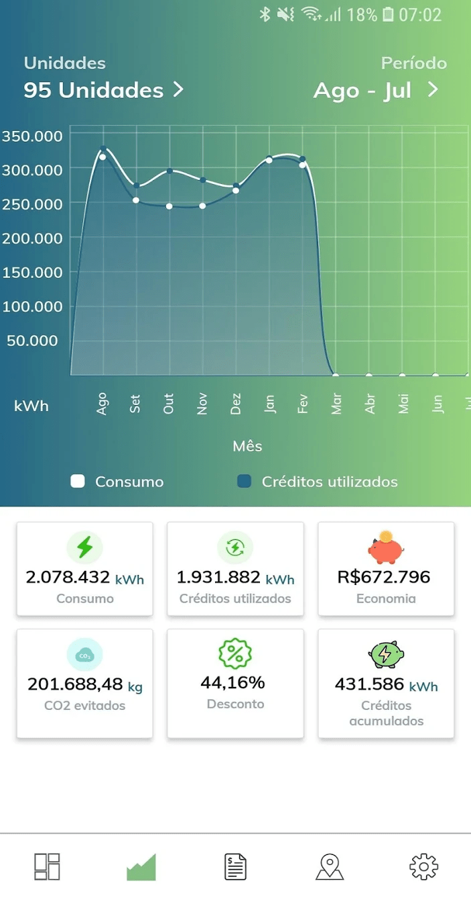
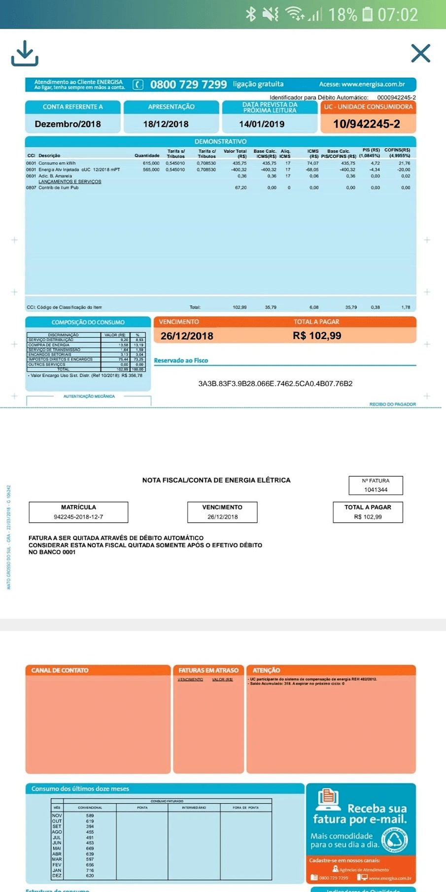

# Energy App

Energy app visualizes the energy consumption data of users in graphical form using D3.JS and react-native.
 
User can see his units and their energy consumption on google maps.
 
Energy app admin is a web-app in react.js that allows admin to manage users and their energy uses. In this admin can see users units location, how much energy they have consumed there.
 

### ScreenShot:-

Figure : 1 Homepage

 

Figure : 2 chart screen

 

Figure : 3 bill screen

 
